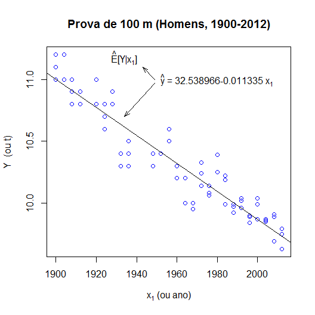

## Introdução

Este tópico tem o objetivo de introduzir notação e procedimentos utilizados na análise de regressão multipla, desenvolvidos no contexto da avaliação de algumas hipóteses. Alguns conjuntos de dados são analisados de forma exploratória, com o intuito principal de exemplificar as técnicas fundamentais usadas em análise de regressão. Não há intenção de se fazer uma análise rigorosa ou se especificar o melhor modelo para cada situação específica, algo que pode ser um exercício interessante para muitos.

### Dados dos resultados dos 100 m nos jogos olímpicos

Esse arquivo contém os resultados, em segundos, da final dos 100m nas olimpíadas, desde 1900 até 2012, para homens e mulheres, incluindo informações sobre o primeiro, segundo e terceiro colocados. As mulheres só começaram a participar dessa prova (e das provas de atletismo de um modo geral) em 1928.

```{r}
olimp<-read.csv("data/olimpiadas.csv")
head(olimp)
```

## Análise Exploratória

Faça um diagrama de dispersão para visualizar os dados dos homens e mulheres, ao longo dos anos, colorindo os pontos com cores rosa (mulheres) e azul (homens).

```{r}
colvec<-ifelse(olimp$sexo=="M","blue","deeppink")
plot(olimp$ano,olimp$t,col=colvec, xlab="ano",ylab="t")
title(main="Resultados dos 100 m (1900-2012)")
grid()

# Comando abaixo:
# valor<-identify(olimp$ano,olimp$t)
## execute o comando acima com o gráfico aberto em Script R
## agora posicione o ponteiro da tela no ponto desejado
## e pressione o botão esquerdo do mouse (pode clicar em vários pontos)
## 
## para parar: pressione o botão direito do mouse e escolhar "parar" 
##
## os números das linhas no data frame serão colocadas na variável valor 
## e "plotadas" no gráfico ao lado do ponto

```

### Identificação de observações no gráfico

Um exame rápido do diagrama de dispersão mostra um dado surpreendente, o record olimpico das mulheres foi estabelecido já há muito tempo e ainda não foi superado. Como encontrar a observação relativa a esse ponto? (é algo útil para identificação de potenciais problemas)

Como exercício, identifique a observação que corresponde ao record feminino ainda não superado (ao menos até a olimpiada de 2012). Use o procedimento acima e veja a posição da observação (esse procedimento indicará que a observação está n linha 40) e mostre o conteúdo dessa linha do data frame:  

```{r}
valor <- 40
olimp[valor,]
```


As informações apresentadas indicam que esse foi o resultado de Florence Griffith-Joyner, conhecida como Flo-Jo, obtido nos jogos de Seul em 1988, que corresponde ao record mundial até hoje não superado. É também de Flo-Jo o record mundial dos 200m, obtidos nos mesmos jogos e também não superado.

## Questões que queremos examinar

Discuta as questões descritas a seguir no contexto das provas masculinas

Pergunta 1 - Há alguma evidência forte de que os tempos na prova de 100 m estão caindo ao longo do tempo? Ainda que isso possa parecer óbvio, há algum argumento forte para defender esse ponto de vista? Quanto em média, por ano, o tempo da prova dos 100 m está caindo?

Pergunta 2 - Há evidência de algum impacto da elevação (altitude) da cidade dos jogos nos tempos da prova? Avalie formalmente. Estime, se houver, o efeito da altitude no tempo da prova.

Como a análise é focada inicialmente somente na prova masculina, vamos criar um data frame específico, contendo somente essas observações, denominado olimpm.


```{r}
olimpm<-olimp[olimp$sexo=="M",]  
plot(olimpm$ano,olimpm$t,xlab="ano",ylab="t",col="blue")
title(main="Prova dos 100 m (Homens, 1900-2012)")
```

## Modelo estatístico 1: regressão linear simples

Motivado pelo próprio comportamento do tempo apresentado no gráfico, vamos considerar um primeiro modelo estatístico, caracterizado por uma regressão linear simples, para representar o fenômeno. Esse modelo é uma caso particular do modelo geral que especificamos no último tópico:

Modelo 1: Regressão linear simples
$$
Y_i=\beta_0+\beta_1x_{i1} + ϵiY_i = \beta_0 + \beta_1 x_{i1} + ϵ_i 
$$

onde $E_i∼N(0,σ)$ como $cov(Ei,Ej)=0,∀i≠jcov(E_i,E_j)=0,∀i≠j$ e outras premissas usuais (veja na definição geral)


Nesse modelo a variável resposta $Y_i$ na notação genérica é representada por $t_i$ (tempo nos 100 m na observação $i$) e a variável explicativa $x_{i1}$ é representada por $ano_i$ (ano dos jogos na observação $i$) no data frame olimpm.

**Considere agora a hipótese:**

$H_0$: “os resultados são constantes ao longo dos anos” essa hipótese, no contexto desse modelo, no contexto estatístico, seria definida por $H_0:\beta_0=0$

indicando que não há efeito dos anos (que caracterizam uma evolução técnica) no tempo em segundos para completar a prova.

Na realidade estamos mais interessados nas hipóteses alternativas $H_a:\beta_1 ≠ 0$ ou, mais especificamente, $H_a:\beta_1<0$.

Estratégia usual: verificação da possibilidade de rejeição de $H_0$ Se houver evidência para rejeição, automaticamente $H_a$ ficará for      talecida. Parece estranho mas é assim que funciona a “lógica” usual de testes de parâmetros.

```{r}
## para estimar os resultados e colocá-los na variável modelo1:
modelo1<-lm(t~ano,data=olimpm) ## t = b0+ b1 ano + E
## para ver os resultados
#summary(modelo1)
```


<BR>

A figura indica os **resultados mais importantes** em <red>vermelho</red>. A forma de apresentação é típica de programas estatísticos. Nesses resultados temos:

Estimativas para $b_0$ e $b_1$: são indicadas por $\hat b_0$ e $\hat b_1$ que tem valores, respectivamente, de $32,538966$ e $-0,011335$. Observe que no início da linha com as estimativas (nos resultados do R) é apresentado nome da variável ao qual o parâmetro está relacionado, ou “Intercept”, para indicar a estimativa para $b_0$ o termo constante da regressão.

Estimativa para $\sigma$: é indicada por $\hat\sigma$ com valor $0,144$.

$R^2$: medida (imperfeita) de qualidade de ajuste da regressão (0 é o pior ajuste, 1 é o melhor). Na regressão linear simples, coincide com o quadrado do coeficiente de correlação entre $Y$ e $X$, ou seja, as variáveis $t$ e anoano no data frame olimpm. Um dos problemas dele é que sempre aumenta se aumentarmos adicionarmos novas variáveis à regressão. O valor obtido $0,881$, para $R^2$, mostra um ajuste razoavelmente bom, algo que é comprovado pela análise visual.

$R^2$ ajustado: como o nome diz, é uma medida, baseada no $R^2$ com um ajuste que considera o número de variáveis explicativas na regressão. É um indicador um pouco melhor da qualidade de ajuste que o próprio $R^2$, para comparação de modelos alternativos.

valores-p associados às hipóteses $H_0$: no final da linha onde aparece cada estimativa $b_i$, aparece o valor-p associado à hipótese $H_0:b_i=0$. No caso, como os valores são próximos de zero, a evidência sugere a rejeição de $H_0:b_0=0$ e $H_0:b_1=0$. Ao final, aparece um outro valor-p, associado a estatística F, que testa a hipótese $H_0:b_1=0,\ldots,b_m=0$ (observe que $b_0$ não está na lista). Como $m=1$, esse teste coincide, em resultado, com o valor-p mostrado na linha da estimativa de $b_1$ (embora sejam testes distintos).


### Apresentação gráfica da curva de regressão e intervalos de confiança para parâmetros

A curva de regressão (teórica) nesse caso, na notação genérica será dada por

$E[Y|x1]=b_0+b_1x_1$ cuja estimativa será dada por $\hat E(Y|x_1)=\hat b_0+ \hat b_1x_1$, numa situação em que $Y$ corresponde a variável tt e $x_1$ à variável ano.

$\hat y$ é comumente usado como símbolo para indicar $\hat E(Y|x_1,x_2,…,x_m)$ para simplificar a notação. Contudo, é muito importante não esquecer o significado verdadeiro de $\hat y$ como a média condicional da variável resposta $Y$, dado o valor da variável explicativa (ou variáveis explicativas, no caso geral).

Assim, com essas considerações e notações, poderiamos definir:

$\hat E[Y|x_1]=\hat y=\hat b_0+ \hat b_1 x_1$ ou já substituindo as estimativas $\hat y=32,538966−0,011335x1$.


Essa curva de regressão pode ser apresentada no diagrama de dispersão que contém os pontos, com os seguintes comandos:

```
modelo1<-lm(t~ano,data=olimpm) ## t = b0+ b1 ano
plot(olimpm$ano,olimpm$t,xlab="ano",ylab="t",col="blue")
title(main="Prova dos 100 m (Homens, 1900-2012)")
abline(modelo1)
```


<BR>

intervalos de confiança para os parâmetros: podemos obter o intervalo de confiança para os “verdadeiros” valores dos $b_0$ e $b_1$, no contexto desse modelo, através de:

```{r}
confint(modelo1,level=0.95) 
```

Os valores obtidos indicam que há 95% de probabilidade dos “verdadeiros” parâmetros estarem contidos nesse intervalo. No caso de $b_1$ por exemplo, há $95\%$ de probabilidade do verdadeiro valor estar dentro no intervalo $[−0,01228,−0,01039]$ o que dá uma boa idéia da incerteza associada à estimativa. A interpretação é muito similar à que fizemos anteriormente para o intervalo de confiança da média teórica ou esperança.

Com esses resultados, temos todos os elementos para responder à primeira pergunta colocada no início do tópico:

**Pergunta 1**: Há alguma evidência forte de que os tempos na prova de $100m$ estão caindo ao longo do tempo? Ainda que isso possa parecer óbvio, há algum argumento forte para defender esse ponto de vista? Quanto em média, por ano, o tempo da prova dos 100 m está caindo nos últimos anos?

Resposta: Tanto a evidência relativa ao valor-p da hipótese $H_0:b_1=0$, próximo de zero, sugerindo rejeição de H0H0, quanto o intervalo de confiança a $95\%$ sugerem os tempos estão caindo de forma estatisticamente significativa. O valor estimado para $b_1$ está entre $[−0,01228,−0,01039]$. Esse resultado estimado sugere que o tempo nos $100m$ tendeu a cair, em média por ano, no período, algo dentro do intervalo $[0,01039,0,01228]$ segundos com $95\%$ de probabilidade.


## Modelo estatístico 2: regressão linear múltipla

Para responder à pergunta 2 colocada no início do tópico, envolvendo um possível efeito da elevação ou altitude nos tempos da prova final de $100m$ da olimpíada, precisamos utilizar um modelo um pouco mais complexo, envolvendo uma regressão linear múltipla com 2 variáveis explicativas:

Modelo 2: regressão linear múltipla
$$
y_i = b_0 + b_1 x_{i1} + b_2 x_{i2} + ϵ_i
$$

onde $ϵ_i \approx N(0,σ)$ com $cov(ϵi,ϵj)=0,∀i≠j$ e outras premissas usuais (veja na definição geral)

Nesse modelo, substituímos a notação $Y_i$ por $y_i$, para simplificar, mas com o entendimento de que $y_i$ é uma variável aleatória, utilizada como a variável resposta, que no conjunto de dados é representada por $t_i$ (tempo nos 100 m na observação $i$). A variável explicativa $x_i$ é representada por $ano_i$ (ano dos jogos na observação $i$). A novidade é a variável $x_i$ que representa $elev_i$ (elevação em $m$ da cidade da observação $i$), do data frame olimpm.

A estimativa dos parâmetros $b_0$, $b_1$ e $b_2$ pode ser feita com muita facilidade através da função lm através de:


```{r}
## para estimar os resultados e colocá-los na variável modelo1:
modelo2<-lm(t~ano+elev,data=olimpm) ## t = b0+ b1 ano + b2 elev + E
## para ver os resultados
summary(modelo2)
```

O modelo 2 parece melhor que o modelo 1. O modelo 2 não só apresentou um $R^2$ ajustado maior (de $0,88$ no modelo 1 subiu para $0,891$ no modelo 2), como o valor-p associado ao parâmetro $b_2$ relacionado ao efeito da variável elev é $0,004$, o que sugere a rejeição da hipótese $H_0:b_2=0$. Isso indica um efeito estatisticamente significativo da variável $elev$, na explicação do tempo nos $100m$. O valor estimado de $b_2$ é $\hat b_2 = −1,08e−4$ ou $\hat b = −0,000108$.

O intervalo de confiança para os parâmetros pode ser obtido por

```{r}
## intervalo de confiança a 95% para os parâmetros
confint(modelo2)
```

para $b_2$ o intervalo de confiança estimado, a $95\%$, foi $[−0,0000354,−0,0001799]$. Esse seria o efeito estimado para cada 1 metro adicional de elevação. Para $1000m$ esse efeito seria $1000$ vezes maior, situando-se entre $[−0,0354,−0,1799]$ segundos com $95\%$ de probabilidade. Ou seja, parece ser vantajoso correr os $100m$ em altitudes mais elevadas, em razão do ar ser mais rarefeito, oferecendo menos resistência aos atletas.

Esse modelo 2, que mostrou-se superior ao modelo 1 pelos critérios utilizados, também indica uma nova estimativa para o intervalo de confiança para o $b_1$, entre $[−0,0121,−0,0108]$ com $95\%$ de probabiliade, muito similar ao obtido no modelo 1.

Assim sendo, podemos oferecer uma possível responder à pergunta 2 colocada no tópico anterior:

Pergunta 2: Há evidência de algum impacto da elevação (altitude) da cidade dos jogos nos tempos da prova? Avalie formalmente. Estime, se houver, o efeito da altitude no tempo da prova.

Resposta: **Sim**, o resultado da análise sugere que o efeito estimado da elevação no tempo dos $100m$ é estatisticamente significativo ($valor-p=0,004$) e negativo na medida que aumenta a elevação. O efeito esperado no tempo dos $100m$, para uma variação de 1000 m na elevação foi estimado dentro do intervalo de confiança $[−0,0354,−0,1799]$ segundos, com $95\%$ de probabilidade. Num trabalho realizado por Mureika 2008 o efeito reportado é de $-0,04$ segundos para cada $1000m$, que está dentro do intervalo de confiança estimado, algo que traz suporte adicional para a noção de que o aumento da elevação pode trazer um benefício à velocidade dos atletas nos $100m$.


.