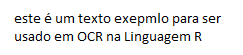
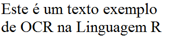
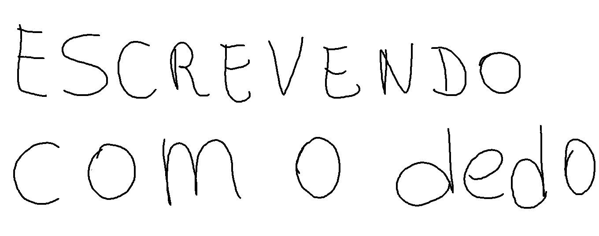

```{r setup, include=FALSE}
knitr::opts_chunk$set(echo = TRUE)
```

Usaremos reconhecimento óptico de caracteres (OCR). Este processo de extrair texto escrito de imagens em texto codificado por máquina. O pacote Tesseract traz um dos melhores motores OCR open-source para R.


### 1-Definindo uma função para verificar se o pacote está instalado

```{r, message=F, warning=F}
is.installed <- function(mypkg) is.element(mypkg, installed.packages()[,1]) 

if(!is.installed("tesseract"))
   install.packages("tesseract")
```

<BR>
**Carregando a Biblioteca**
```{r, message=F, warning=F}
library("tesseract")
```
<BR>

### 2-Carregando Imagens e processando OCR

**A Primeria Imagem**


<BR><BR>
***Carregar imagem  e extrair caracteres por OCR com baixa resolução***

```{r, message=F, warning=F}
text <- ocr("data/imagemExemplo.png")
cat(text)
```
<BR>
Dê uma olhada nos resultados. Algumas palavras estão erradas porque a resolução é baixa.
<BR>
<BR>
**Segunda Imagem**


<BR><BR>
***Carregar imagem  e extrair caracteres por OCR com baixa resolução***

```{r, message=F, warning=F}
text <- ocr("data/imagemExemplo2.png")
cat(text)
```

<br>
Agora, você pode carregar uma imagem escrita manualmente.
Eu desenheo esse texto no Paint Brush do windows com o meu dedo sobre uma tela de toque.

***Carregando uma imagem escrita a mão no Paint Brush***



```{r, message=F, warning=F}
text <- ocr("data/imagemExemplo3.png")
cat(text)
```


<BR>
[The Scientist](http://www.thescientist.com.br)
<BR><BR>
