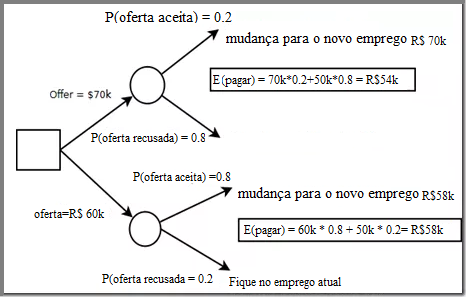

```{r setup, include=FALSE}
knitr::opts_chunk$set(echo = TRUE)
```


## Introdução

Vamos dizer que você está no meio de uma negociação salarial, e você quer saber se você deve ser agressivo em sua oferta ou conservador. Uma maneira de ajudar com a decisão é fazer uma árvore de decisão. Trabalharemos com os seguintes pressupostos:

- Você está em um emprego atualmente fazendo $R\$ 50k$.
- Você tem as opções entre pedir $R\$60k$ (que será aceito com probabilidade 0.8) ou $R\$ 70$ (que será aceito com probabilidade 0.2).
- Você tem uma chance. Se o seu preço pedir é rejeitado, você ficar no seu trabalho atual e continuar a fazer $R\$ 50k$. (Esta é uma daquelas suposições simplificadoras que poderíamos dispensar mais tarde.)
- Esta simplificação da realidade pode ser representada com uma árvore de decisão:

<center></center>

Vamos em frente e coloquei o retorno esperado para cada uma dessas decisões. Porque a abordagem mais conservadora tem um maior retorno esperado, este modelo sugere que você deve tomar a abordagem conservadora.

Uma lacuna claramente é que esta árvore de decisão mostra apenas duas decisões, mas realmente você tem uma variedade de decisões; Você não está preso com $60k$ ou $70k$ para pedir o preço. Você pode ir com $65k$, ou $62.5k$, ou qualquer outra coisa. Então, qual seria o melhor preço?

Outra vez, nós olhamos o pagamento esperado, que está pedindo o preço *probabilidade (oferta aceitada) + R$50k* probabilidade (oferta rejeitada). Nesse caso, precisamos modelar a probabilidade de que a oferta seja aceita no intervalo de ofertas possíveis, e não apenas nos dois pontos. O modelo logístico funciona muito bem para modelar a probabilidade, e é isso que vou usar aqui para estender o modelo de dois pontos. Na verdade, um modelo logístico com dois parâmetros pode ser ajustado exatamente a dois pontos, e por isso é o que usaremos o código abaixo.

Aqui está o meu código R comentado para implementar este modelo:

- Retornar a oferta para maximizar o retorno esperado
- Isto assume um jogo com uma decisão e uma consequência
- Você dá uma oferta, e é aceita ou recusada. 
- Se aceito, você recebe um salário (Uma função de) da oferta. 
- Se recusado, você permanece no antigo emprego e recebe um salário de ev.no (presumivelmente um salário atual, mas definido como 0 se você for desempregado).
- A probabilidade de rejeição é modelada com uma função logística definida por dois pontos ($x_1, p_y.x_1$) e ($x_2, p_y.x_2$)
- Por exemplo, se você esperava um rej de $20%$. Prob. Com uma oferta de $140k$, então
- $X_1$, $p_y.x_1 = 140$, $0.2$. Similarmente com $x_2$, $p_y.x_2$
- A recompensa esperada é modelada como oferta $P(sim | oferta) + ev.no * P(não|oferta)$,
- Talvez com modificações para contabilizar benefícios, negociação, etc.
- É definido na função payoff abaixo.
- Finalmente, alto é definido como qualquer coisa acima do que você estaria esperando para oferecer
- E é usado para criar os limites de plotagem e definir os limites na otimização
- Rotina. - Modelar a probabilidade de nenhuma oferta salarial dada
- Aqui temos uma função logística definida por ($x_1, p_y.x_1$) e ($x_2, p_y.x_2$)
- Note que qlogis é a função logit inversa
- Também, as matrizes em R são definidas em forma de coluna maior, não em forma de linha maior como

```{r}
my.offer <- function(x1=60,py.x1=.2,x2=70,py.x2=.8,ev.no=50,high=100,p.payoff=1) {
  theta <- solve(matrix(c(1,1,x1,x2),nc=2),matrix(qlogis(c(py.x1,py.x2)),nc=1))
  xseq <- seq(ev.no,high,length=100)
  yseq1 <- 1/(1+exp(-theta[1]-theta[2]*xseq))   
  payoff <- function(x) {
    tmp <- exp(-theta[1]-theta[2]*x)
    return( (ev.no + ifelse(ev.no>x*p.payoff,ev.no,x*p.payoff)*tmp)/(1+tmp) )
  }     
  yseq <- payoff(xseq)   # plots
  par(mfrow=c(1,2))
  plot(xseq,yseq1,type='l',xlab='Oferta',ylab='P(Não|X)')
  plot(xseq,yseq,type='l',xlab='Oferta',ylab='Salário Esperado')
  return(optimize(payoff,interval=c(ev.no,high),maximum=TRUE))
}
my.offer()
```

Assim, este modelo sugere que a oferta ideal está perto de $R\$62k$, com um valor pago esperado de cerca de $R\$58k$. Como um efeito colateral, um par de gráficos são produzidos: dando a probabilidade de rejeição em função do preço pedido e o salário esperado (payoff) em função do preço pedido.

## Outro Exemplo

Nesse exercício, nós temos a informação de um banco alemão contendo as informações a respeito dos clientes e temos que montar uma árvore de decisão que retornasse se o cliente era um bom ou mau pagador.

```{r}
library(rpart)
library(ROCR)
library(xlsx)

# Le a base de dados
dados <- read.xlsx("data/german_credit_21.xlsx",sheetIndex = 1)

# Discretiza as variaveis
Creditability_index1 <- which(dados$Creditability == 1)
Creditability_index2 <- which(dados$Creditability == 0)
dados$Creditability[Creditability_index1] <- 'good';
dados$Creditability[Creditability_index2] <- 'bad';

## ifelse avalia antes de executar
dados$CreditAmount = ifelse(dados$CreditAmount <= 2500, "0-2500",
 ifelse(dados$CreditAmount < 5000, "5000+","2500-5000"))

## Gera indices da base treino e teste
train_index = sample(1:nrow(dados), 0.6*nrow(dados), replace = FALSE);

## Gera base treino e teste
train = data.frame();
train = dados[train_index,];

test = data.frame();
test = dados[-train_index,];

## Usa rpart para decision tree
train_tree = rpart(Creditability~., data = train);

## Plota a árvore de decisão
plot(train_tree);

## Insere a legenda dos galhos
text(train_tree, pretty = 0, cex = 0.6);

## Predict como funcao para trazer a probabilidade do cliente ser mau/bom
test_tree_predict = predict(train_tree, newdata = test);
head(test_tree_predict);

## Predict com tipo 'classe' retorna se é bom ou mau
test_tree_predict = predict(train_tree, newdata = test, type = "class");
head(test_tree_predict);

## confusion matrix
table(test_tree_predict, test$Creditability);
```

### Exemplo de uso de algoritmos indutores de árvore de decisão

Divisão do dataset em conjunto de treinamento e teste

Acessando o dataset e criando os conjuntos de treinamento (70% das observações) e testes (30% das observações):

```{r}
set.seed(1234)
data(iris)
ind <- sample(2, nrow(iris), replace = TRUE, prob = c(0.7, 0.3))
trainData <- iris[ind == 1, ]
testData <- iris[ind == 2, ]
```

**Criando o classificador com o algoritmo ctree**

Faz a carga da biblioteca party e constrói a árvore de decisão usando o ctree:

```{r message=FALSE}
library(party,quietly = TRUE)
myFormula <- Species ~ Sepal.Length + Sepal.Width + Petal.Length + Petal.Width
iris_ctree <- ctree(myFormula, data = trainData)
```

**Constrói a matriz de confusão usando o conjunto de treinamento:**

```{r}
table(predict(iris_ctree), trainData$Species)

```


Visualizando a árvore de decisão gerada:

```{r}
print(iris_ctree)
plot(iris_ctree)
plot(iris_ctree, type = "simple")

```

Gerando a matriz de confusão usando o conjunto de treinamento:

```{r}
testPred <- predict(iris_ctree, newdata = testData)
table(testPred, testData$Species)

```

**Criando o classificador com o algoritmo J48**

Importando a biblioteca e criando o modelo:

```{r}
library(RWeka)
iris_j48 <- J48(myFormula, data = trainData)
```

Obtendo a matriz de confusão:

```{r}
table(predict(iris_j48), trainData$Species)
pred <- predict(iris_j48)
```


Imprindo a árvore gerada:

```{r}
print(iris_j48)
plot(iris_j48)
```


**Testando ambos os modelos no conjunto de teste**

Resultados do modelo gerado com o algoritmo ctree:

```{r}
testPred <- predict(iris_ctree, newdata = testData)
table(testPred, testData$Species)

```

Resultados do modelo gerado com o algoritmo J48:

```{r}
testPred <- predict(iris_j48, newdata = testData)
table(testPred, testData$Species)

```

**Fazendo cross-validation**

A biblioteca ipred possui funções que são específicas para a etapa de cross-validation.

**Cross validation** - A validação cruzada é uma técnica para avaliar a capacidade de generalização de um modelo, a partir de um conjunto de dados [1]. Esta técnica é amplamente empregada em problemas onde o objetivo da modelagem é a predição. Busca-se então estimar o quão preciso é este modelo na prática, ou seja, o seu desempenho para um novo conjunto de dados.

Executando um 10-fold cross-validation para o modelo gerado pelo ctree:
```{r}
library(ipred)
set.seed(1234)
errorCtree <- numeric(10)
for (i in 1:10) errorCtree[i] <- errorest(Species ~ ., data = iris, model = ctree)$error
errorCtree

```

```{r}
summary(errorCtree)

```

Executando um 10-fold cross-validation para o modelo gerado pelo J48:

```{r}
set.seed(1234)
errorJ48 <- numeric(10)
for (i in 1:10) errorJ48[i] <- errorest(Species ~ ., data = iris, model = J48)$error
errorJ48

```

**Sumarizando**

```{r}
summary(errorJ48)
```


Predizendo os valores das classes para um dataset sintetizado

Predizer as classes para novos objetos:

```{r}
iris_j48 <- J48(myFormula, data = iris)

newdata <- data.frame(Sepal.Length <- rnorm(1000, mean(iris$Sepal.Length), sd(iris$Sepal.Length)), 
    Sepal.Width <- rnorm(1000, mean(iris$Sepal.Width), sd(iris$Sepal.Width)), 
    Petal.Width <- rnorm(1000, mean(iris$Petal.Width), sd(iris$Petal.Width)), 
    Petal.Length <- rnorm(1000, mean(iris$Petal.Length), sd(iris$Petal.Length)))

pred <- predict(iris_j48, newdata)

```


Mostrando visualmente que árvores de decisão não separam conjunto de dados de forma não linear:

```{r}
plot(newdata[, 4], newdata[, 3], pch = 21, xlab = "Tamanho das Pétalas", ylab = "Largura das Pétalas", 
    bg = c("red", "blue", "green")[as.numeric(pred)], main = "Novos dados")
```


[The Scientist](http://www.thescientist.com.br)