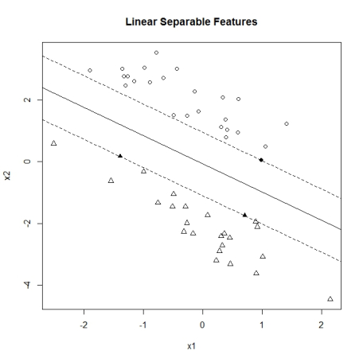
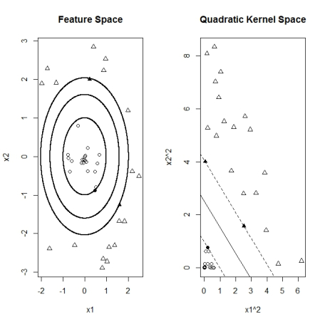

```{r setup, include=FALSE}
knitr::opts_chunk$set(echo = TRUE)
```

## SVN - Máquina de Suporte Vetorial

É um método de classificação. Neste algoritmo, traçamos cada item de dados como um ponto no espaço n-dimensional (onde n é o número de recursos que você tem) com o valor de cada característica sendo o valor de uma coordenada particular.

Por exemplo, se tivéssemos apenas duas características como altura e comprimento de cabelo de um indivíduo, primeiro teríamos que traçar essas duas variáveis no espaço bidimensional, onde cada ponto tem duas coordenadas (essas coordenadas são conhecidas como vetores de suporte)

### Aprendizado de Máquina e Kernels

Uma aplicação comum de aprendizado de máquina (ML) é a aprendizagem e classificação de um conjunto de características de dados brutos por um algoritmo ou técnica ML. Neste contexto, um kernel ML atua para o algoritmo ML como guarda-sol, um telescópio ou uma lupa para o olho observador de um pesquisador. Um bom kernel filtra os dados brutos e apresenta suas características à máquina de uma forma que torna a tarefa de aprendizagem tão simples quanto possível.

Um total de três exemplos são apresentados. Um kernel linear é mostrado para resolver o primeiro exemplo, mas falha para a segunda tarefa. Lá um kernel quadratico é bem sucedido. Em seguida, um terceiro exemplo é apresentado para que ambos os núcleos lineares e quadraticos não são suficientes. Lá um kernel bem sucedido pode ser gerado fora de uma mistura de ambos os kernels abaixo. Isso ilustra que os kernels podem ser gerados a partir de bases, resultando em produtos que são mais poderosos na solução da tarefa em mãos do que cada componente individual.

### Máquinas do vetor do apoio

Considere uma máquina de vetores de suporte (SVM) para uma tarefa de classificação. Dado um conjunto de pares de vetores de pontos de dados de recurso xe de rótulos de classificador $y = \{- 1,1\}$, a tarefa do algoritmo SVM é aprender a agrupar recursos x por classificadores. Depois de treinar em um conjunto de dados conhecido, a máquina SVM destina-se a prever corretamente a classe $y$ de um vetor x de características anteriormente não visto.

As aplicações em financiamento quantitativo de máquinas de vectores de suporte incluem, por exemplo, tarefas de previsão, em que x consiste em características derivadas de uma série histórica de indicadores de stock e y é um sinal de venda ou compra. Outro exemplo pode ser que x consistem em contagens de palavras-chave dentro de um texto, como anúncios de notícias, e o classifica de novo de acordo com seu impacto nos movimentos do mercado. Fora do financiamento, um SVM baseado em texto poderia ser usado para filtrar e-mails a serem encaminhados para a caixa de entrada ou para a pasta de spam.

### Kernel Linear

Como indicado acima, o SVM funciona agrupando pontos de recursos de acordo com seus classificadores.
Para ilustração no exemplo de brinquedo abaixo dois vetores de características bidimensionais $x = \{x_1, x_2\}$ são gerados de tal maneira que a classe $y = -1$ pontos (triângulos) são bem separados da classe $y = 1$ (círculos).

O algoritmo SVM encontra a maior margem linear possível que separa estas duas regiões. Os separadores marginais repousam sobre os pontos de posto avançado que estão bem na linha de frente de suas respectivas regiões. Esses pontos, marcados como dois triângulos em negrito e um círculo em negrito na figura abaixo, são chamados de "vetores de suporte", pois estão apoiando as linhas de delimitação. De facto, a tarefa de aprendizagem de SVM consiste completamente em determinar estes pontos de suporte de vector e a distância de margem que separa as regiões. Após o treinamento, todos os outros pontos de não-suporte não são usados para previsão.

<center></center>

No espaço de características lineares, os vetores de suporte somam a um vetor de hipóteses global h, $h = \sum c_i x_i$, de modo que as fronteiras de classificação são dadas pelas linhas $h_x + b = 1$ e $h_x + b = -1$ centradas em torno de $h_x + b = 0$.terminando estes pontos de vetor de suporte e a distância de margem que separa as regiões. Após o treinamento, todos os outros pontos de não-suporte não são usados para previsão.

O código abaixo utiliza a implementação ksvm no pacote R 'kernlab', fazendo uso dos tutoriais "Jean-Philippe Vert" para a representação gráfica das linhas de separação de classificação.

```{r message=FALSE}
require('kernlab',quietly = TRUE)
 
kfunction <- function(linear =0, quadratic=0)
{
  k <- function (x,y)
 {
     linear*sum((x)*(y)) + quadratic*sum((x^2)*(y^2))
  }
  class(k) <- "kernel"
  k
}
 
n = 25
a1 = rnorm(n)
a2 = 1 - a1 + 2* runif(n)
b1 = rnorm(n)
b2 = -1 - b1 - 2*runif(n)
x = rbind(matrix(cbind(a1,a2),,2),matrix(cbind(b1,b2),,2))
y <- matrix(c(rep(1,n),rep(-1,n)))
                       
svp <- ksvm(x,y,type="C-svc",C = 100, kernel=kfunction(1,0),scaled=c())
plot(c(min(x[,1]), max(x[,1])),c(min(x[,2]), max(x[,2])),type='n',xlab='x1',ylab='x2')
title(main='Linear Separable Features')
ymat <- ymatrix(svp)
points(x[-SVindex(svp),1], x[-SVindex(svp),2], pch = ifelse(ymat[-SVindex(svp)] < 0, 2, 1))
points(x[SVindex(svp),1], x[SVindex(svp),2], pch = ifelse(ymat[SVindex(svp)] < 0, 17, 16))
    
# Extract w and b from the model   
w <- colSums(coef(svp)[[1]] * x[SVindex(svp),])
b <- b(svp)
    
# Draw the lines
abline(b/w[2],-w[1]/w[2])
abline((b+1)/w[2],-w[1]/w[2],lty=2)
abline((b-1)/w[2],-w[1]/w[2],lty=2)
```


### Quadratic Kernel

O exemplo a seguir ilustra um caso em que os pontos de recurso são separados não-lineares. Pontos da classe $y = 1$ (círculos abaixo) são colocados em uma região interna rodeada de todos os lados por pontos de classe $y = -1$, novamente representados como triângulos. Neste exemplo não existe uma única linha reta (linear) que possa separar ambas as regiões. No entanto, aqui ainda é possível encontrar um tal separador, transformando os pontos $x = \{x_1, x_2 \}$ do espaço de características para um espaço de kernel quadrático com pontos dados pelas coordenadas quadradas correspondentes $\{x_1 ^ 2, x_2 ^ 2 \}$.

A técnica de transformar do espaço de características em uma medida que permite uma separação linear pode ser formalizada em termos de kernels. Assumindo que $\phi()$ é uma função de transformação de coordenadas vetoriais. Por exemplo, um espaço de coordenadas quadrado seria $\{\phi(x)_1, \phi(x)_2\} = \{x_1^2, x_2^2\}$. A tarefa de separação SVM está agora agindo no espaço transformado para encontrar os vetores de suporte que geram

$H\phi(x) + b = \pm_1$
Para o vetor de hipóteses $h =\sum c_i \Phi (x_i)$ dado pela soma sobre os pontos $x_i$ do vetor de suporte. Juntando ambas as expressões, obtemos:

$\sum c_i K(x_i, x) + b = \pm 1$
Com a função de kernel escalar $k(x_i, x) = \phi (x_i) \Phi (x)$. O kernel é composto a partir do produto escalar entre um vetor de suporte x_i e outro ponto de vetor de característica x no espaço transformado.

Na prática, o algoritmo SVM pode ser totalmente expresso em termos de kernels sem ter que realmente especificar a transformação de espaço de recurso. Os kernels populares são, por exemplo, potências superiores do produto escalar linear (núcleo polinomial). Outro exemplo é uma distância ponderada probabilidade entre dois pontos (kernel gaussiano).

A implementação de uma função de kernel quadrática bidimensional permite ao algoritmo SVM encontrar vetores de suporte e separar corretamente as regiões. Abaixo do gráfico abaixo ilustra-se que as regiões não-lineares são separadas linearmente após a transformação para o espaço quadrado do kernel.


<center></center>

```{r message=FALSE,warning=FALSE}
require('kernlab')
kfunction <- function(linear =0, quadratic=0)
{
  k <- function (x,y)
 {
     linear*sum((x)*(y)) + quadratic*sum((x^2)*(y^2))
  }
  class(k) <- "kernel"
  k
}
 
n = 20
r = runif(n)
a = 2*pi*runif(n)
a1 = r*sin(a)
a2 = r*cos(a)
r = 2+runif(n)
a = 2*pi*runif(n)
b1 = r*sin(a)
b2 = r*cos(a)
x = rbind(matrix(cbind(a1,a2),,2),matrix(cbind(b1,b2),,2))
y <- matrix(c(rep(1,n),rep(-1,n)))
                           
svp <- ksvm(x,y,type="C-svc",C = 100, kernel=kfunction(0,1),scaled=c())
par(mfrow=c(1,2))
plot(c(min(x[,1]), max(x[,1])),c(min(x[,2]), max(x[,2])),type='n',xlab='x1',ylab='x2')
title(main='Feature Space')
ymat <- ymatrix(svp)
points(x[-SVindex(svp),1], x[-SVindex(svp),2], pch = ifelse(ymat[-SVindex(svp)] < 0, 2, 1))
points(x[SVindex(svp),1], x[SVindex(svp),2], pch = ifelse(ymat[SVindex(svp)] < 0, 17, 16))
    
# Extract w and b from the model   
w2 <- colSums(coef(svp)[[1]] * x[SVindex(svp),]^2)
b <- b(svp)
 
x1 = seq(min(x[,1]),max(x[,1]),0.01)
x2 = seq(min(x[,2]),max(x[,2]),0.01)
 
points(-sqrt((b-w2[1]*x2^2)/w2[2]), x2, pch = 16 , cex = .1 )
points(sqrt((b-w2[1]*x2^2)/w2[2]), x2, pch = 16 , cex = .1 )
points(x1, sqrt((b-w2[2]*x1^2)/w2[1]), pch = 16 , cex = .1 )
points(x1,  -sqrt((b-w2[2]*x1^2)/w2[1]), pch = 16, cex = .1 )
 
points(-sqrt((1+ b-w2[1]*x2^2)/w2[2]) , x2, pch = 16 , cex = .1 )
points( sqrt((1 + b-w2[1]*x2^2)/w2[2]) , x2,  pch = 16 , cex = .1 )
points( x1 , sqrt(( 1 + b -w2[2]*x1^2)/w2[1]), pch = 16 , cex = .1 )
points( x1 , -sqrt(( 1 + b -w2[2]*x1^2)/w2[1]), pch = 16, cex = .1 )
 
points(-sqrt((-1+ b-w2[1]*x2^2)/w2[2]) , x2, pch = 16 , cex = .1 )
points( sqrt((-1 + b-w2[1]*x2^2)/w2[2]) , x2,  pch = 16 , cex = .1 )
points( x1 , sqrt(( -1 + b -w2[2]*x1^2)/w2[1]), pch = 16 , cex = .1 )
points( x1 , -sqrt(( -1 + b -w2[2]*x1^2)/w2[1]), pch = 16, cex = .1 )
 
xsq <- x^2
svp <- ksvm(xsq,y,type="C-svc",C = 100, kernel=kfunction(1,0),scaled=c())
 
plot(c(min(xsq[,1]), max(xsq[,1])),c(min(xsq[,2]), max(xsq[,2])),type='n',xlab='x1^2',ylab='x2^2')
title(main='Quadratic Kernel Space')
ymat <- ymatrix(svp)
points(xsq[-SVindex(svp),1], xsq[-SVindex(svp),2], pch = ifelse(ymat[-SVindex(svp)] < 0, 2, 1))
points(xsq[SVindex(svp),1], xsq[SVindex(svp),2], pch = ifelse(ymat[SVindex(svp)] < 0, 17, 16))
    
# Extract w and b from the model   
w <- colSums(coef(svp)[[1]] * xsq[SVindex(svp),])
b <- b(svp)
    
# Draw the lines
abline(b/w[2],-w[1]/w[2])
abline((b+1)/w[2],-w[1]/w[2],lty=2)
abline((b-1)/w[2],-w[1]/w[2],lty=2)
```

[The Scientist](http://www.thescientist.com.br)


