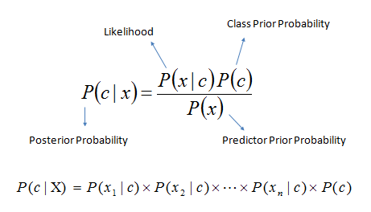
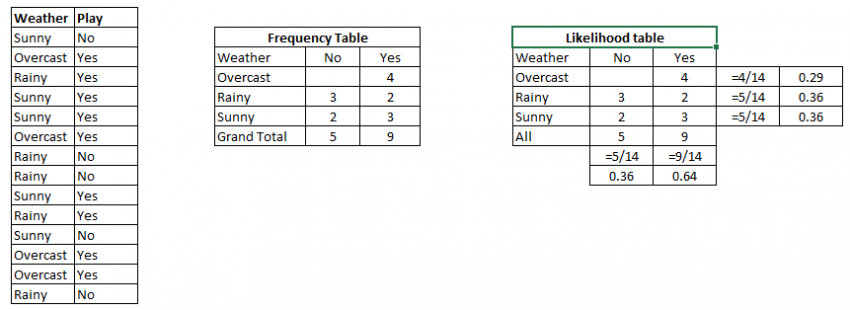

```{r setup, include=FALSE}
knitr::opts_chunk$set(echo = TRUE)
```


## Naive Bayes

### Introdução

É uma técnica de classificação baseada no teorema de Bayes com uma suposição de independência entre preditores. Em termos simples, um classificador Naive Bayes assume que a presença de uma característica particular em uma classe não está relacionada com a presença de qualquer outra característica. Por exemplo, uma fruta pode ser considerada como uma maçã se é vermelho, redondo, e cerca de 3 centímetros de diâmetro. Mesmo que essas características dependam umas das outras ou da existência das outras características, um classificador ingênuo Bayes consideraria todas essas propriedades para contribuir de forma independente para a probabilidade de que este fruto é uma maçã.

O modelo bayesiano ingênuo é fácil de construir e particularmente útil para conjuntos de dados muito grandes. Juntamente com a simplicidade, Naive Bayes é conhecido por superar até mesmo métodos de classificação altamente sofisticados.

O teorema de Bayes fornece uma maneira de calcular a probabilidade posterior $P(c|x)$ de $P(c)$, $P(x)$ e $P(x|c)$. Veja a equação abaixo:

<center></center>

Onde,

$P(c|x)$ é a probabilidade posterior da classe (alvo) dado preditor (atributo).
$P(c)$ é a probabilidade prévia de classe.
$P(x|c)$ é a probabilidade que é a probabilidade de predito classe dada.
$P(x)$ é a probabilidade prévia de preditor.

**Exemplo**: Vamos compreendê-lo usando um exemplo. Abaixo eu tenho um conjunto de dados de treinamento de tempo e correspondente variável alvo 'Play'. Agora, precisamos classificar se os jogadores jogarão ou não com base nas condições climáticas. Vamos seguir as etapas abaixo para executá-lo.

**Passo 1**: converter o conjunto de dados para tabela de frequência  
**Passo 2**: Criar Tabela de Verossimilhança encontrando as probabilidades como Probabilidade de $Nublado = 0.29$ e a probabilidade de jogar é $0.64$.  

<center></center>

**Passo 3**: Agora, use equação Bayesian Naive para calcular a probabilidade posterior para cada classe. A classe com maior probabilidade posterior é o resultado da predição.

**Problema**: Os jogadores pagarão se o tempo estiver ensolarado, esta afirmação está correta?

Podemos resolvê-lo usando o método acima discutido, então $P(Sim|Ensolarado) = P (Ensolarado Sim) * P (Sim) / P (Ensolarado)$

Aqui temos $P(Ensolarado | Sim) = 3/9 = 0,33$, $P(Ensolarado) = 5/14 = 0,36$, $P(Sim) = 9/14 = 0,64$

Agora, P(Sim | Ensolarado) = 0,33 * 0,64 / 0,36 = 0,60$, que tem maior probabilidade.

Naive Bayes usa um método semelhante para prever a probabilidade de diferentes classes baseadas em vários atributos. Este algoritmo é usado principalmente na classificação de texto e com problemas com várias classes.

## Naive Bayes em R com o exemplo do dataset Iris

Podemos mostrar os dados da íris com este comando, basta digitar "iris" para mostrar todos os dados:

```{r}
library("caret")
head(iris)
```

Ou podemos usar o comando "names" para mostrar os nomes de rótulos / colunas

```{r}
names(iris)
```

Neste caso, atribuímos os dados da coluna 1-4 (features) à variável x, e a classe para a variável y

```{r}
x = iris[,-5]
y = iris$Species
```


Criando o modelo com validação cruzada = 10 (k-fold com k=10)

```{r}
model = train(x,y,'nb',trControl=trainControl(method='cv',number=10))
```

Mostrando o modelo e resumo

```{r}
summary(model)
model
```

Use *predict* para obter valor de predição e classe de resultado:

```{r}
#predict(model$finalModel,x)
table(predict(model$finalModel,x)$class,y)
```

Se você quiser traçar os recursos com Naive Bayes, você pode usar este comando:


**Legenda**

```{r echo=FALSE}
plot.new()
legend('center','groups',names(iris), lty = c(1,2,3,4,5),
       col=c('red','green','blue',"brown","yellow"),ncol=3,bty ="n")

naive_iris <- NaiveBayes(iris$Species ~ ., data = iris)
plot(naive_iris,legendplot = FALSE)
```


[The Scientist](http://www.thescientist.com.br)

